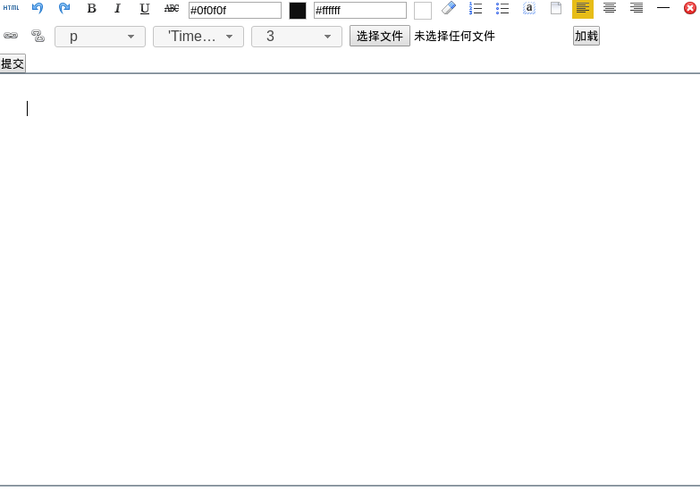

simple editor
------

这是一个简单的 [所见即所得](https://zh.wikipedia.org/zh/所見即所得 ) 文本编辑器

1. 界面



2. 优点
* 代码少  

核心文件只有*4*个，分别是index.html,/js/event.js,/js/editorTool.js,/js/editor/Editor.js

* 兼容性

兼容ie9及以上，firefox，chrome，opera 

3. 核心代码
```js
function Editor(){
	this.browser = null;
	this.elements = new Array();
	this.styles = new Array();
	this.range = null;
	this.editorId = null;//编辑器id
	/**
	 * 初始化
	 */
	this.initial = function(editorId){
		this.browser = $.browser;
		this.editorId = editorId;
	}
	this.execComment = function(type,value){
		if (type == "heading") {
			var sel = getSelection();
			var range = sel.getRangeAt(0);
			sel.removeAllRanges();
			var start=range.startOffset;
			var end=range.endOffset;
			var startContainer = range.startContainer;
			var endContainer = range.endContainer;
			var node = range.startContainer;
			var parents = $(node).parentsUntil("#" + this.editorId);
			if (parents[parents.length - 1].parentNode.id == this.editorId) {
				var nodes = $(node).parentsUntil("p,h1,h2,h3,h4,h5,h6,h7,li");
				var p = nodes.length > 0 ? nodes[nodes.length - 1].parentNode : node.parentNode;
				if (p.nodeName.toLowerCase() == "li") {
					$(p).wrapInner(document.createElement(value));
				}
				else {
					$(p).wrapInner(document.createElement(value));
					$(p).replaceWith($(p).children());
				}
			}
			range.setStart(startContainer,start);
			range.setEnd(endContainer,end);
			sel.addRange(range);
		}
		else if(type == "justifyLeft"||type == "justifyCenter"||type == "justifyRight"){
			var sel = getSelection();
			var range = sel.getRangeAt(0);
			sel.removeAllRanges();
			var node = range.startContainer;
			var parents = $(node).parentsUntil("#" + this.editorId);
			if (parents[parents.length - 1].parentNode.id == this.editorId) {
				var nodes = $(node).parentsUntil("p,h1,h2,h3,h4,h5,h6,h7,li");
				var p = nodes.length > 0 ? nodes[nodes.length - 1].parentNode : node.parentNode;
				if (p.nodeName.toLowerCase() == "li") {
					var start=range.startOffset;
					var end=range.endOffset;
					var startContainer = range.startContainer;
					var endContainer = range.endContainer;
					$(p).wrapInner(document.createElement("p"));
					$(p).children().attr("align",type.substring(7,type.length));
					range.setStart(startContainer,start);
					range.setEnd(endContainer,end);
				}
				else {
					$(p).attr("align",type.substring(7,type.length));
				}
			}
			sel.addRange(range);
		}else{
			document.execCommand(type,false,value);
		}
	}
	this.backupCursorState = function(){
		var sel=getSelection();
		this.range=sel.getRangeAt(0);
	}
	this.returnCursorState = function(){
		var sel=getSelection();
		sel.removeAllRanges();
		sel.addRange(this.range);
	}
	/*
	 * @param linkName 链接名
	 * @param linkSrc 链接地址
	 * @param isBlank 是否打开新页面
	 */
	this.createLink = function(linkName,linkSrc,isBlank){
		var sel=getSelection();
		range=sel.getRangeAt(0);
		sel.removeAllRanges();
		var $link = $("<a href='http://"+linkSrc+"'>"+linkName+"</a>");
		if(isBlank){
			$link.attr("target","_blank");
		}
		range.insertNode($link[0]);
		range.selectNodeContents($link[0]);
		sel.addRange(range);
	}
	this.focus = function(id){
		$("#"+this.editorId).focus();
		var sel=getSelection();
		range=sel.getRangeAt(0);
		sel.removeAllRanges();
		if(id == this.editorId||!id){
			if($("#"+this.editorId).text() == ""){
				var $p = $("<p><br/></p>");
				$("#"+this.editorId).html("");
				$("#"+this.editorId).append($p);
//				range.selectNodeContents($p[0]);
				range.setStart($p[0],0);
				range.setEnd($p[0],0);
			}else{
				range.selectNodeContents($("#"+this.editorId)[0]);
				range.collapse();
			}
		}else{
			var element = document.getElementById(id);
			range.selectNodeContents(element);
		}
		sel.addRange(range);
	}
	this.clear = function(id){
		var editor = document.getElementById(id);
		editor.innerHTML = "";
	}
	/**
	 * 处理非ie浏览器在回车时不会自动添加p，而是添加div
	 */
	this.insertParagraph = function(){
		$p=$("<p><br/></p>");
		var sel=getSelection();
		if(sel.anchorNode){
			var range=sel.getRangeAt(0);
			var start=range.startOffset;
			var end=range.endOffset;
			var container=range.startContainer;
			var node=range.startContainer.parentNode;
			if(node.nodeName.toLowerCase()=="div"&&node.id!=this.editorId){
				$p.html($(node).html());
				$(node).after($p);
				$(node).remove();
				sel.removeAllRanges();
				range.setStart($p[0].firstChild,start);
				range.setEnd($p[0].firstChild,end);
				sel.addRange(range);
			}
		}
	}
	/**
	 * 查询forecolor等的值
	 * @param {array} cmds
	 */
	this.queryCommandValues = function(cmds){
		var values = new Array();
		for(key in cmds){
			if(cmds[key]=="heading"){
				var sel=getSelection();
				var range=sel.getRangeAt(0);
				var node = range.startContainer;
				var parents = $(node).parentsUntil("#"+this.editorId);
				if(parents[parents.length-1].parentNode.id==this.editorId){
					var nodes = $(node).parentsUntil("p,h1,h2,h3,h4,h5,h6,h7,li");
					var p = nodes.length>0?nodes[nodes.length-1].parentNode:node.parentNode;
					if(p.nodeName.toLowerCase() == "li"){
						values[key] = "p";
					}else{
						values[key] = p.nodeName.toLowerCase();
					}
				}
			}else{
				//firefox下可以得到正确的背景颜色，格式为rgb(R,G,B)，其他为rgba()
				document.execCommand('styleWithCSS',false,true);
				values[key] = document.queryCommandValue(cmds[key]);
				document.execCommand('styleWithCSS',false,false);
			}
		}
		return values;
	}
	/**
	 * 查询bold，italic等的状态
	 * @param {Object} cmds
	 */
	this.queryCommandStates = function(cmds){
		var values = new Array();
		for(key in cmds){
			values[key] = document.queryCommandState(cmds[key]);
		}
		return values;

	}
	/**
	 * 是否选区折叠
	 */
	this.isCollapsed = function(){
		var sel=getSelection();
		var range=sel.getRangeAt(0);
		return range.collapsed;
	}
}
```


